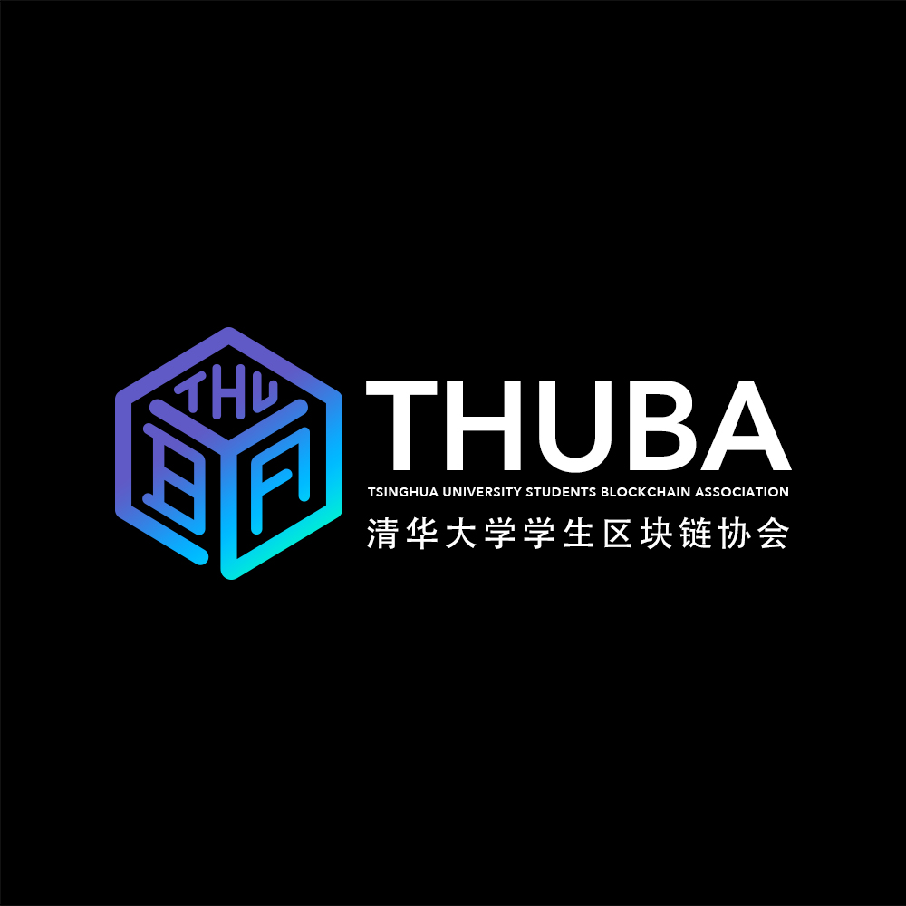
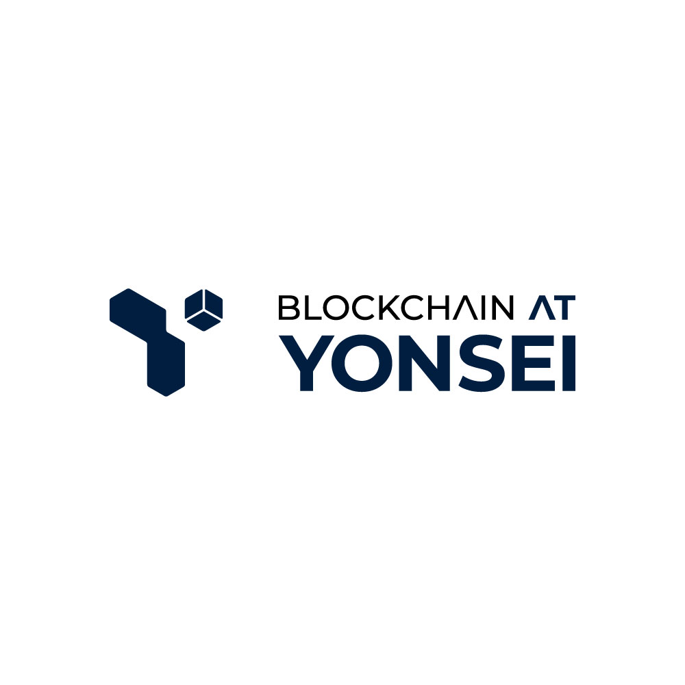
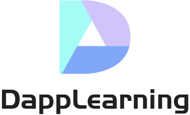

# Decentralized University

**English** | 中文(Need to be translated) | 한국어(Need to be translated)

## Introduction

This Initiative is to unite all Universities Students around the world, **an open community to learn and realize the potentials of blockchain together**. This Initiative is strongly supported by [Polygon](https://polygon.technology/), the ethereum scaling solution for everyone.

## How to?
- How to [***Join***](./Manuals/How_to_Join_Decentralized_University.md) the Decentralized University
- How to [***Contribute***](./Manuals/How_to_Contribute_to_Decentralized_University.md) to the Decentralized University
- How to Propose an Event? (WIP)

## Events/Social Platforms

Come Subscribe to our [Events Calendar](https://calendar.google.com/calendar/u/7?cid=ZGVjZW50cmFsaXplZHVuaUBnbWFpbC5jb20) to stay updated! 

Stay connected with the community here:
- [Discord](https://discord.gg/sCgMbv3Xus)
- [Youtube](https://www.youtube.com/channel/UCHHgW953B95eQagoRC4d0BQ/)
- [Twitter](https://twitter.com/0xDeUniversity)

## Our University Members

Here is the [guide](./Manuals/How_to_Join_Decentralized_University.md) to List your Universitie's blockchain association/club to the repo.

<table>
	<tr>
		<td>
        	
		</td>
		<td>
			
    	</td>
	</tr>
	<tr>
		<td>
			<a href="https://thublockchain.org/">Tsinghua University - THUBA</a>
		</td>
		<td>
			<a href="https://yonseiblockchainlab.com/">Yonsei University</a>
		</td>
	</tr>
</table>

## Our Beloved Educators!

<table>
	<tr>
		<td>
        	
		</td>
		<td>
        	
		</td>
	</tr>
	<tr>
		<td>
			<a href="https://polygon.technology/">Polygon</a>
		</td>
		<td>
			<a href="https://github.com/rebase-network/Dapp-Learning">DappLearning</a>
		</td>
	</tr>
</table>

## Resources

1. Courses Outline
2. Researches on the industry
3. Researches on projects.
